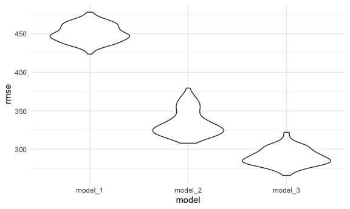

P8105 HW6
================
Hansheng Zhang
2021-12-02

``` r
library(tidyverse)
```

    ## ── Attaching packages ─────────────────────────────────────── tidyverse 1.3.1 ──

    ## ✓ ggplot2 3.3.5     ✓ purrr   0.3.4
    ## ✓ tibble  3.1.4     ✓ dplyr   1.0.7
    ## ✓ tidyr   1.1.3     ✓ stringr 1.4.0
    ## ✓ readr   2.0.1     ✓ forcats 0.5.1

    ## ── Conflicts ────────────────────────────────────────── tidyverse_conflicts() ──
    ## x dplyr::filter() masks stats::filter()
    ## x dplyr::lag()    masks stats::lag()

``` r
library(modelr)
library(p8105.datasets)

knitr::opts_chunk$set(
  fig.width = 6,
  fig.asp = .6,
  out.width = "90%"
)
theme_set(theme_minimal() + theme(legend.position = "bottom"))
options(
  ggplot2.continuous.colour = "viridis",
  ggplot2.continuous.fill = "viridis"
)
scale_colour_discrete = scale_colour_viridis_d
scale_fill_discrete = scale_fill_viridis_d
```

# Problem 1

Load and clean birthweight data. Then propose regression model and
compare to two other models.

``` r
birthweight_df = 
  read_csv("data/birthweight.csv") %>% 
  janitor::clean_names() %>% 
  mutate(
    mrace = as.factor(mrace),
    frace = as.factor(frace),
    babysex = as.factor(babysex),
    malform = as.factor(malform)
  )
```

    ## Rows: 4342 Columns: 20

    ## ── Column specification ────────────────────────────────────────────────────────
    ## Delimiter: ","
    ## dbl (20): babysex, bhead, blength, bwt, delwt, fincome, frace, gaweeks, malf...

    ## 
    ## ℹ Use `spec()` to retrieve the full column specification for this data.
    ## ℹ Specify the column types or set `show_col_types = FALSE` to quiet this message.

``` r
summary(birthweight_df)
```

    ##  babysex      bhead          blength           bwt           delwt      
    ##  1:2230   Min.   :21.00   Min.   :20.00   Min.   : 595   Min.   : 86.0  
    ##  2:2112   1st Qu.:33.00   1st Qu.:48.00   1st Qu.:2807   1st Qu.:131.0  
    ##           Median :34.00   Median :50.00   Median :3132   Median :143.0  
    ##           Mean   :33.65   Mean   :49.75   Mean   :3114   Mean   :145.6  
    ##           3rd Qu.:35.00   3rd Qu.:51.00   3rd Qu.:3459   3rd Qu.:157.0  
    ##           Max.   :41.00   Max.   :63.00   Max.   :4791   Max.   :334.0  
    ##     fincome      frace       gaweeks      malform     menarche    
    ##  Min.   : 0.00   1:2123   Min.   :17.70   0:4327   Min.   : 0.00  
    ##  1st Qu.:25.00   2:1911   1st Qu.:38.30   1:  15   1st Qu.:12.00  
    ##  Median :35.00   3:  46   Median :39.90            Median :12.00  
    ##  Mean   :44.11   4: 248   Mean   :39.43            Mean   :12.51  
    ##  3rd Qu.:65.00   8:  14   3rd Qu.:41.10            3rd Qu.:13.00  
    ##  Max.   :96.00            Max.   :51.30            Max.   :19.00  
    ##     mheight          momage     mrace        parity            pnumlbw 
    ##  Min.   :48.00   Min.   :12.0   1:2147   Min.   :0.000000   Min.   :0  
    ##  1st Qu.:62.00   1st Qu.:18.0   2:1909   1st Qu.:0.000000   1st Qu.:0  
    ##  Median :63.00   Median :20.0   3:  43   Median :0.000000   Median :0  
    ##  Mean   :63.49   Mean   :20.3   4: 243   Mean   :0.002303   Mean   :0  
    ##  3rd Qu.:65.00   3rd Qu.:22.0            3rd Qu.:0.000000   3rd Qu.:0  
    ##  Max.   :77.00   Max.   :44.0            Max.   :6.000000   Max.   :0  
    ##     pnumsga      ppbmi            ppwt           smoken           wtgain      
    ##  Min.   :0   Min.   :13.07   Min.   : 70.0   Min.   : 0.000   Min.   :-46.00  
    ##  1st Qu.:0   1st Qu.:19.53   1st Qu.:110.0   1st Qu.: 0.000   1st Qu.: 15.00  
    ##  Median :0   Median :21.03   Median :120.0   Median : 0.000   Median : 22.00  
    ##  Mean   :0   Mean   :21.57   Mean   :123.5   Mean   : 4.145   Mean   : 22.08  
    ##  3rd Qu.:0   3rd Qu.:22.91   3rd Qu.:134.0   3rd Qu.: 5.000   3rd Qu.: 28.00  
    ##  Max.   :0   Max.   :46.10   Max.   :287.0   Max.   :60.000   Max.   : 89.00

``` r
# check for missing data
sum(complete.cases(birthweight_df))
```

    ## [1] 4342

``` r
sum(!complete.cases(birthweight_df))
```

    ## [1] 0

No missing data!

I did a quick literature review on factors that influence a baby’s birth
weight. I found an article that suggested gestational age, maternal age,
baby’s sex, mother’s race, and first born all have associations with
birth weight.

The article can be found here:
<https://pubmed.ncbi.nlm.nih.gov/7570074/>

``` r
model_1 = lm(bwt ~ gaweeks + momage + babysex + mrace + parity, data = birthweight_df)
model_1 %>% broom::tidy()
```

    ## # A tibble: 8 × 5
    ##   term        estimate std.error statistic   p.value
    ##   <chr>          <dbl>     <dbl>     <dbl>     <dbl>
    ## 1 (Intercept)   851.       96.0      8.86  1.16e- 18
    ## 2 gaweeks        60.6       2.21    27.4   4.50e-152
    ## 3 momage          1.64      1.90     0.865 3.87e-  1
    ## 4 babysex2      -90.7      13.7     -6.63  3.81e- 11
    ## 5 mrace2       -237.       15.3    -15.5   6.13e- 53
    ## 6 mrace3       -136.       69.7     -1.95  5.17e-  2
    ## 7 mrace4       -146.       30.7     -4.76  1.98e-  6
    ## 8 parity        124.       66.7      1.87  6.21e-  2

``` r
birthweight_df %>% 
  modelr::add_residuals(model_1) %>%
  modelr::add_predictions(model_1) %>% 
  ggplot(aes(x = pred, y = resid)) + 
  geom_point(alpha = 0.3) +
  geom_smooth(se = FALSE, method = "lm", color = "blue") + 
  labs(
    title = "Predicted vs. Residuals",
    x = "Predicted",
    y = "Residuals"
    ) 
```

    ## `geom_smooth()` using formula 'y ~ x'


Now I will compare my model to two other models using cross validation.

``` r
model_2 = lm(bwt ~ blength + gaweeks, data = birthweight_df)
model_3 = lm(bwt ~ bhead + blength + babysex + bhead * blength + bhead * babysex + blength * babysex + bhead * blength * babysex, data = birthweight_df)
```

``` r
birthweight_cv = 
    crossv_mc(birthweight_df, 100) %>% 
    mutate(
        train = map(train, as.tibble),
        test = map(test, as.tibble)
    ) %>% 
   mutate(
        model_1 = map(train, ~lm(bwt ~ gaweeks + momage + babysex + mrace + parity, data = .x)),
        model_2 = map(train, ~lm(bwt ~ blength + gaweeks, data = .x)),
        model_3 = map(train, ~lm(bwt ~ bhead + blength + babysex + bhead * blength + bhead * babysex + blength * babysex + bhead * blength * babysex, data = .x))
    ) %>% 
    mutate(
        rmse_model_1 = map2_dbl(model_1, test, ~rmse(model = .x,data = .y)),
        rmse_model_2 = map2_dbl(model_2, test, ~rmse(model = .x,data = .y)),
        rmse_model_3 = map2_dbl(model_3, test, ~rmse(model = .x,data = .y))
    )
```

    ## Warning: `as.tibble()` was deprecated in tibble 2.0.0.
    ## Please use `as_tibble()` instead.
    ## The signature and semantics have changed, see `?as_tibble`.
    ## This warning is displayed once every 8 hours.
    ## Call `lifecycle::last_warnings()` to see where this warning was generated.

    ## Warning in predict.lm(model, data): prediction from a rank-deficient fit may be
    ## misleading

``` r
#Violin plots
birthweight_cv %>% 
  select(starts_with("rmse")) %>% 
  pivot_longer(
    everything(),
    names_to = "model", 
    values_to = "rmse",
    names_prefix = "rmse_"
  ) %>% 
  mutate(model = fct_inorder(model)) %>% 
  ggplot(aes(x = model, y = rmse)) + geom_violin()
```


As the plot shown, model\_1 has the best distribution of RMSE, and the
model with main effect only has the worst distribution of RMSE.


    # Problem 2


    ```r
    weather_df = 
      rnoaa::meteo_pull_monitors(
        c("USW00094728"),
        var = c("PRCP", "TMIN", "TMAX"), 
        date_min = "2017-01-01",
        date_max = "2017-12-31") %>%
      mutate(
        name = recode(id, USW00094728 = "CentralPark_NY"),
        tmin = tmin / 10,
        tmax = tmax / 10) %>%
      select(name, id, everything())

    ## Registered S3 method overwritten by 'hoardr':
    ##   method           from
    ##   print.cache_info httr

    ## using cached file: ~/Library/Caches/R/noaa_ghcnd/USW00094728.dly

    ## date created (size, mb): 2021-12-03 14:51:07 (7.614)

    ## file min/max dates: 1869-01-01 / 2021-11-30
